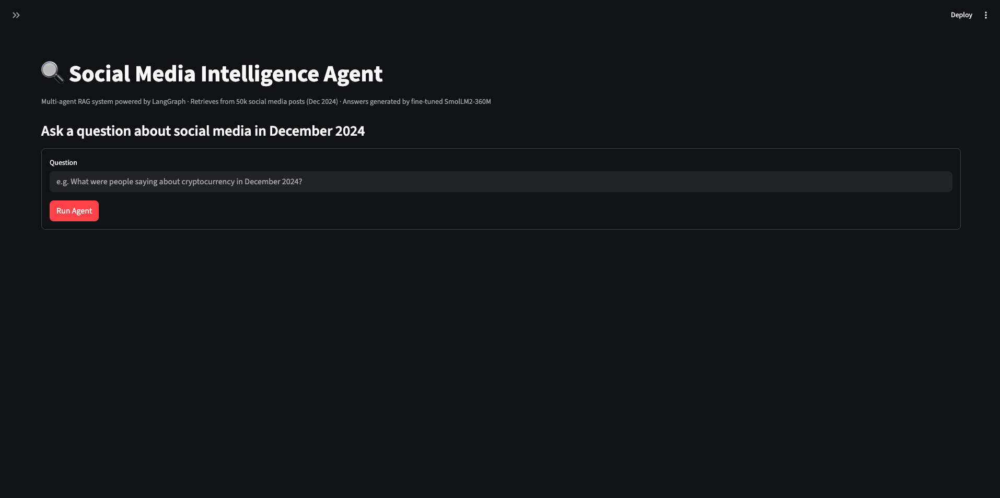
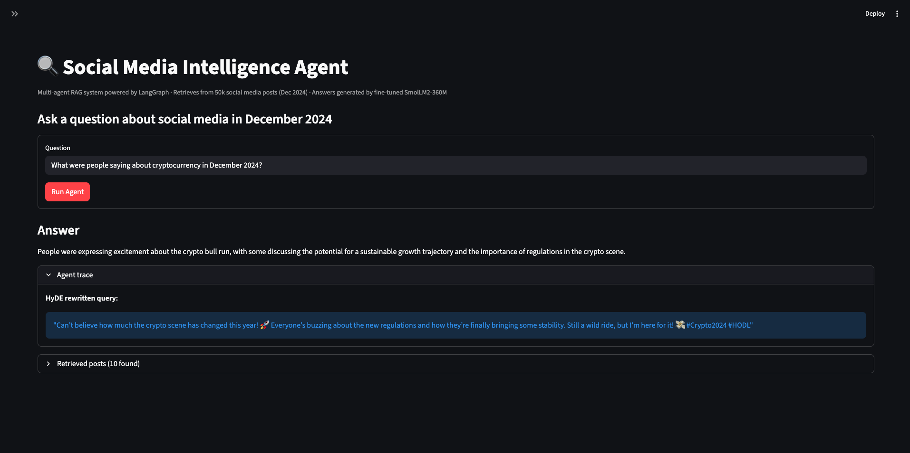
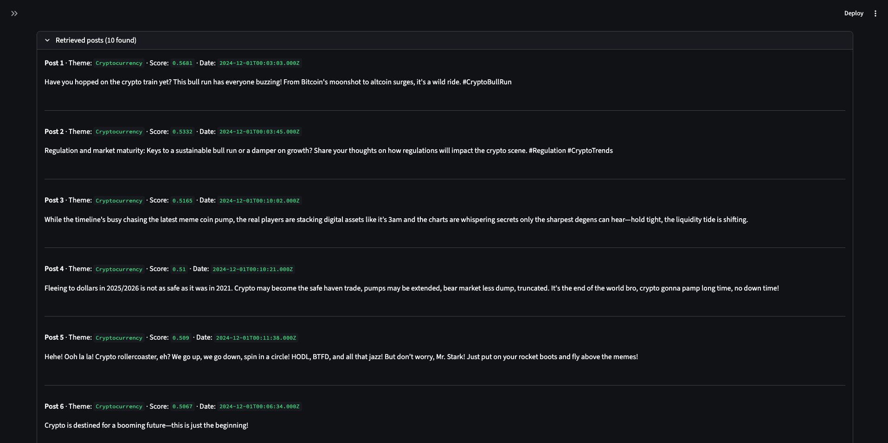
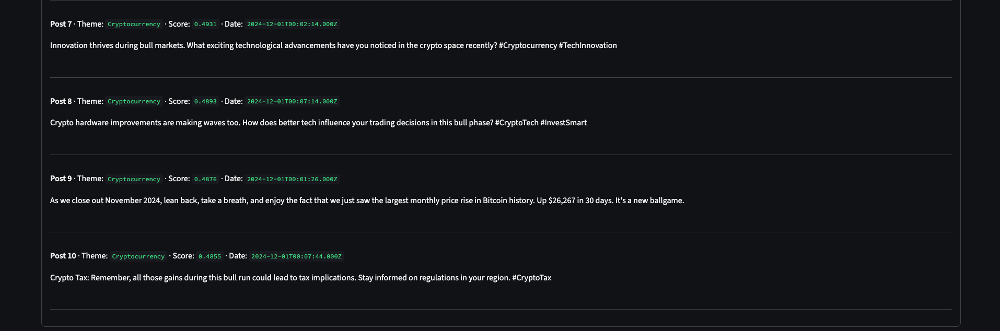

# Social Media Intelligence Agent

A question-answering system over 50,000 real social media posts, built to explore and evaluate RAG pipeline design. The project covers the full ML workflow: data ingestion, systematic retrieval experiments, LoRA fine-tuning a language model on synthetic domain-matched data, and quantitative evaluation using RAGAS metrics.

**Stack:** LangGraph · LangChain · Pinecone · OpenAI · HuggingFace Transformers · PEFT · RAGAS · Streamlit

## What Was Built

- **Agentic RAG pipeline** using LangGraph with HyDE query rewriting (GPT-4o-mini) and semantic retrieval over a Pinecone vector index of 50,000 embedded social media posts
- **LoRA fine-tuned answer model** — `SmolLM2-360M-Instruct` fine-tuned on 1,000 synthetic (posts, question, answer) triples generated from the same domain as the retrieval index, targeting only 0.23% of total parameters
- **6 systematic retrieval experiments** isolating top-k, query enhancement, reranking, embedding model, chunking strategy, and hybrid search — each with a stated hypothesis and recorded results
- **Quantitative evaluation** comparing 4 pipeline configurations across 3 reference-free RAGAS metrics, with honest interpretation of where fine-tuning helps and where it falls short
- **27 unit tests** covering preprocessing, node logic, and ingestion with full mocking (no API calls required)

## Demo

**Home page** — enter a question and submit to run the full pipeline:



**Agent trace** — shows the HyDE-rewritten query generated by `gpt-4o-mini`:



**Retrieved posts** — the top-10 posts returned by Pinecone, with theme, score, and timestamp:





## System Overview

### Pipeline

Every query passes through the same three nodes in sequence:

| Node | Model | Role |
|---|---|---|
| `hyde_node` | gpt-4o-mini | Rewrites the question as a hypothetical social media post |
| `retrieve_node` | Pinecone | Retrieves top-10 relevant posts from the vector index |
| `answer_node` | SmolLM2-360M (LoRA fine-tuned) | Summarizes retrieved posts into a final answer |

HyDE is applied unconditionally. Experiments showed that always rewriting the query outperforms conditional routing — see [Design Decisions](#design-decisions) for details.

### Vector Index

The Pinecone index holds 50,000 English social media posts from the
[Exorde December 2024 dataset](https://huggingface.co/datasets/Exorde/exorde-social-media-december-2024-week1),
embedded with OpenAI's `text-embedding-3-small` (1536 dimensions, cosine similarity).
Pinecone stores only lightweight metadata; full post text is resolved at query time
from a local lookup dict rebuilt from the HuggingFace dataset.

### Fine-tuned Answer Model

`SmolLM2-360M-Instruct` (360M parameter causal LM) is fine-tuned using LoRA (PEFT)
on 1,000 synthetic (posts, question, answer) triples generated from the Exorde dataset
using GPT-4o-mini — the same domain as the retrieval index, ensuring the training
distribution matches the model's actual inference task. Fine-tuning targets the `q_proj`
and `v_proj` attention layers (`r=8, alpha=32`) and trains only 0.23% of total parameters
(~819k of 362M). The adapter weights are committed to this repository under `fine_tuned_model/`.

## Evaluation Results

Configs B, C, and D were scored across 7 questions using three reference-free RAGAS metrics.
Full per-question scores are in `evaluation_results.json`.

| Config | Faithfulness | Answer Relevancy | Context Precision |
|---|:-:|:-:|:-:|
| **B — Basic RAG** (GPT-4o-mini) | **0.787** | 0.385 | **0.601** |
| **C — Advanced RAG (base SmolLM2)** | 0.594 | 0.417 | 0.561 |
| **D — Advanced RAG (fine-tuned SmolLM2)** | 0.691 | **0.514** | 0.383 |

### Interpretation

**Config B is the strongest overall.** GPT-4o-mini produces answers that stay most faithfully
grounded in the retrieved posts (0.787) and retrieves the most precisely ranked context (0.601).
This is expected — GPT-4o-mini is a significantly larger and more capable model than SmolLM2-360M.

**Fine-tuning meaningfully improves SmolLM2 (C -> D).** Config D outperforms Config C on all
three metrics. The base model (Config C) frequently hallucinates or repeats retrieved text
verbatim rather than synthesising it, reflected in its low faithfulness score. Fine-tuning on
domain-matched synthetic data reduces this behaviour.

**Fine-tuning does not close the gap with GPT-4o-mini.** Config D's faithfulness (0.691) and
context precision (0.383) remain below Config B. This is an honest and expected result —
SmolLM2-360M has roughly 1,000× fewer parameters. The practical trade-off is that Config D's
answer generation runs locally with no per-query API cost, while Config B requires an OpenAI
API call to produce each answer. Note that HyDE query rewriting calls GPT-4o-mini in both
configs — the local/API distinction applies to the answer step only.

### Caveat: Answer Relevancy reliability

Several Answer Relevancy scores are exactly 0.0 across all configs — including cases where the
raw answer is clearly on-topic. This is a known edge case in RAGAS's `ResponseRelevancy` metric:
when the embedding similarity between the generated probe question and the original question falls
below an internal threshold, the score collapses to zero rather than returning a low-but-nonzero
value. The Answer Relevancy column should be treated as directionally useful but not fully
reliable at this sample size.

## Design Decisions

### LangGraph: Deterministic Pipeline, Not Dynamic Routing

The pipeline is implemented as a LangGraph `StateGraph` but the compiled graph is a fixed
linear sequence — `hyde_node -> retrieve_node -> answer_node` — with no conditional edges or
runtime routing. Experiment 2 tested conditional HyDE (routing based on query type) and found
it underperformed unconditional HyDE, so routing was abandoned and the graph converged on a
straight sequence.

LangGraph was retained because it provides clean state management via a typed `AgentState`
dict, makes the data-flow between nodes explicit, and produces a built-in graph visualisation.
For a fixed pipeline a plain function chain would also work — LangGraph earns its place here
by making the structure inspectable and easy to extend if routing is added later.

### Not Adopted: Hybrid Search

Hybrid search (dense + BM25 sparse vectors) was built and evaluated in Experiment 6 but not adopted in the production pipeline. Results showed it consistently underperforms pure dense retrieval on this dataset:

| Config | Avg Score |
|---|---|
| Dense only (`alpha=1.0`) | 0.490 |
| Hybrid (`alpha=0.75`) | 0.394 |
| Hybrid (`alpha=0.5`) | 0.306 |

BM25 rewards exact keyword overlap, but social media posts are short, informal, and rarely repeat query terms verbatim. Adding sparse signal introduced noise that hurt retrieval quality. Dense embeddings capture semantic similarity more reliably for this corpus, so `app.py` continues to use `PineconeRetriever` only.

### Not Adopted: Metadata Filtering

Pre-filtering the vector search by metadata fields (theme, date, source) before querying Pinecone was considered but not implemented for three reasons specific to this dataset:

1. **Single-week coverage** — the dataset is `exorde-social-media-december-2024-week1`. All 50,000 posts are from the same week, making date filtering meaningless.
2. **Automated theme tags** — `primary_theme` is generated automatically by Exorde's classifier, not human-annotated. Social media posts frequently span multiple topics, and single-label classification produces enough noise that hard filtering on theme would exclude genuinely relevant posts.
3. **No source field** — the dataset does not include which platform or domain each post came from, ruling out source-based filtering entirely.

Metadata filtering would be a high-value improvement on a multi-week, multi-source corpus with curated labels. It was a design decision not to pursue it here rather than a gap.

## RAG Experiments

`notebooks/rag_experiments.ipynb` systematically evaluates different RAG configurations
to find the best setup for this system. Each experiment isolates one variable, states
a hypothesis, measures retrieval quality across 7 test questions, and records findings.

| Experiment | Variable | Configurations |
|---|---|---|
| 1 | Top-k | k = 5, 10, 20 |
| 2 | Query enhancement | None, always HyDE, conditional HyDE, multi-query |
| 3 | Reranking | None, cross-encoder, LLM-based |
| 4 | Embedding model | `text-embedding-3-small`, `BAAI/bge-large-en-v1.5` |
| 5 | Chunking strategy | Individual posts, theme-grouped |
| 6 | Hybrid search | Dense-only (α=1.0), 75/25 blend (α=0.75), equal blend (α=0.5) |

Experiments 1–3 require only the primary Pinecone index. Experiments 4, 5, and 6 require
their respective indexes to be built first (see **Populating the Index** below).

To run the notebook:

```bash
cd notebooks
jupyter notebook rag_experiments.ipynb
```

Results from all experiments are saved to `rag_experiment_results.json`.

## Running the Evaluation

```bash
python -m scripts.evaluate
```

Runs 7 test questions through 4 configurations to measure the contribution of each
system component:

| Config | Setup |
|---|---|
| **A — Base LLM** | gpt-4o-mini with no retrieval |
| **B — Basic RAG** | Pinecone retriever + gpt-4o-mini, no agents |
| **C — Advanced RAG (base)** | Full agentic pipeline with untuned SmolLM2-360M |
| **D — Advanced RAG (fine-tuned)** | Full agentic pipeline with LoRA fine-tuned SmolLM2-360M |

Configs B, C, and D are scored using three reference-free [RAGAS](https://docs.ragas.io) metrics:

| Metric | What it measures |
|---|---|
| **Faithfulness** | Are the claims in the answer grounded in the retrieved posts? |
| **Answer Relevancy** | Does the answer actually address the question? |
| **Context Precision** | Are the retrieved posts relevant to the question? |

Config A is excluded from RAGAS scoring — it has no retrieved context to evaluate against.
Per-question scores and per-config averages are saved to `evaluation_results.json`.

## Sample Questions

- "What were people saying about cryptocurrency and Bitcoin in December 2024?"
- "What happened with the Syria conflict in early December 2024?"
- "How did people feel about AI tools and ChatGPT on social media?"
- "What were the trending topics on social media during the first week of December 2024?"
- "What was the public reaction to Joe Biden on social media in December 2024?"

## Setup

### Prerequisites

**Python 3.11 or 3.12 is required.** PyTorch does not have builds for Python 3.13+.

```bash
python --version  # must be 3.11.x or 3.12.x
```

This project requires:
- **OpenAI API key** — for embeddings (`text-embedding-3-small`) and the HyDE node (`gpt-4o-mini`)
- **Pinecone API key** — for vector storage and retrieval

### Install

```bash
# 1. Clone and enter the repo
git clone <repo-url>
cd social-media-analysis

# 2. Create and activate a virtual environment (Python 3.11 or 3.12)
python3.11 -m venv venv
source venv/bin/activate

# 3. Install dependencies
pip install -r requirements.txt

# 4. Configure API keys
cp .env.example .env
# Edit .env and fill in OPENAI_API_KEY and PINECONE_API_KEY
```

### Populating the Index

Three ingestion scripts are available, each building a different Pinecone index.
The primary index is required to run the app; the others are only needed for the
RAG experiments notebook.

| Script | Index env var | Embedding model | Purpose |
|---|---|---|---|
| `scripts/ingest.py` | `PINECONE_INDEX_NAME` | `text-embedding-3-small` | Primary index used by the app |
| `scripts/ingest_bge.py` | `PINECONE_BGE_INDEX_NAME` | `BAAI/bge-large-en-v1.5` (local) | Experiment 4 — embedding model comparison |
| `scripts/ingest_hybrid.py` | `PINECONE_HYBRID_INDEX_NAME` | `text-embedding-3-small` + BM25 | Experiment 6 — hybrid search (dotproduct metric) |
| `scripts/ingest_theme_grouped.py` | `PINECONE_THEME_INDEX_NAME` | `text-embedding-3-small` | Experiment 5 — chunking strategy comparison |

Run the primary index first:

```bash
python -m scripts.ingest
```

Runtime is approximately 30–60 minutes depending on API throughput. The index only
needs to be populated once; subsequent app runs query the existing index.

`scripts/ingest_bge.py` embeds all 50,000 posts locally using `BAAI/bge-large-en-v1.5` and
requires no API calls. A GPU is strongly recommended — CPU inference on this model is very slow.

### Running the Web App

```bash
streamlit run app.py
```

Opens at `http://localhost:8501`. On first launch the app will:

1. Download and cache the Exorde dataset, then rebuild the text lookup (~2 min)
2. Download the SmolLM2-360M base model from HuggingFace (first time only)
3. Load the LoRA adapter from `fine_tuned_model/`
4. Compile the LangGraph graph

Subsequent runs skip steps 1–3 thanks to caching.

### Re-training the Answer Model

The committed adapter weights can be reproduced by running:

```bash
python -m scripts.generate_training_data   # generate training_data.jsonl first
python -m scripts.train
```

This fine-tunes `SmolLM2-360M-Instruct` on the synthetic Exorde dataset generated by
`scripts/generate_training_data.py`, using LoRA, and saves the adapter weights to `fine_tuned_model/`.
A GPU is recommended (~4 minutes on CUDA; significantly longer on CPU). No API keys are required.

## Project Structure

```
social-media-analysis/
├── app.py                      # Streamlit front-end
├── config.py                   # Central model name configuration
├── agents/
│   ├── state.py                # AgentState TypedDict
│   ├── prompts.py              # HyDE prompt template
│   ├── nodes.py                # Node functions (hyde, retrieve, answer)
│   └── graph.py                # LangGraph graph definition and compilation
├── rag/
│   ├── preprocessing.py        # Shared Exorde dataset loading and cleaning
│   └── retriever.py            # PineconeRetriever (dense) + HybridRetriever (dense + BM25)
├── models/
│   └── smollm.py               # SmolLM2-360M loader and generate function
├── scripts/
│   ├── ingest.py               # Populates Pinecone index using text-embedding-3-small
│   ├── ingest_bge.py           # Populates Pinecone index using BAAI/bge-large-en-v1.5
│   ├── ingest_hybrid.py        # Populates hybrid Pinecone index (dense + BM25 sparse vectors)
│   ├── ingest_theme_grouped.py # Populates Pinecone index using theme-grouped chunking
│   ├── generate_training_data.py # Generates synthetic training data using GPT-4o-mini
│   ├── train.py                # LoRA fine-tuning script for the answer model
│   └── evaluate.py             # Evaluation script (4 configs x 7 questions)
├── notebooks/
│   └── rag_experiments.ipynb   # RAG configuration experiments and comparisons
├── tests/
│   ├── test_nodes.py           # Agent node unit tests
│   ├── test_preprocessing.py   # Text cleaning unit tests
│   ├── test_ingest.py          # Metadata sanitization unit tests
│   └── conftest.py             # Pytest path configuration
├── fine_tuned_model/           # LoRA adapter weights (~2 MB, committed)
├── requirements.txt
└── .env.example
```
